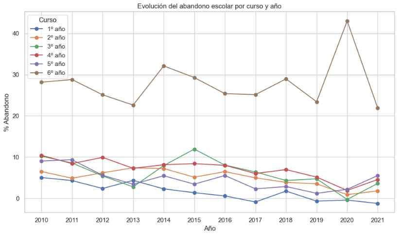
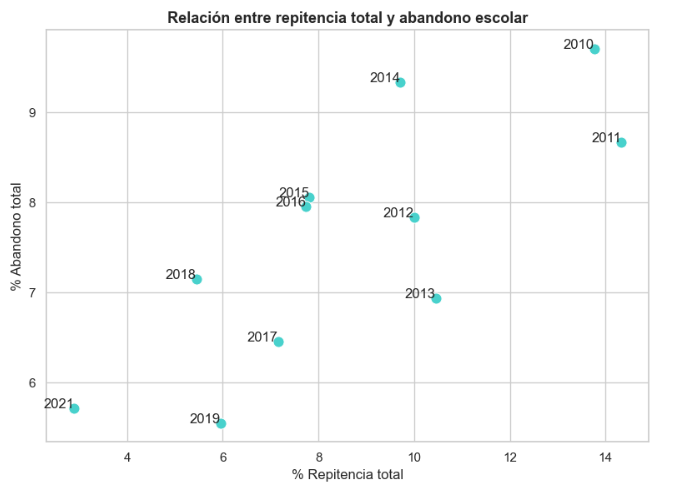
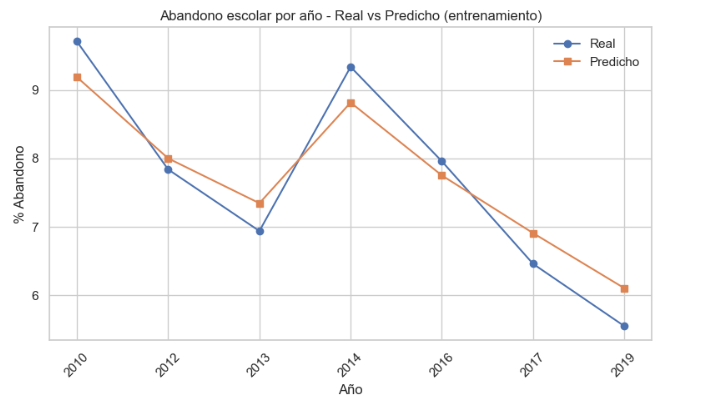

# Predicción del Abandono Escolar en Nivel Secundario – Tierra del Fuego

Este proyecto analiza el fenómeno del abandono escolar en la educación secundaria de la provincia de Tierra del Fuego, Argentina, mediante técnicas de aprendizaje automático y análisis exploratorio de datos educativos oficiales.

El trabajo permite identificar patrones relevantes, evaluar modelos predictivos de abandono y comprender mejor la relación entre variables como repitencia, sobreedad y promoción efectiva.

Video presentación: [Ver video en Google Drive](https://drive.google.com/file/d/1WGfOljuTdOVR5wRnUK_Py2YvobCvbK-5/view?usp=sharing)

---

## Contenido del repositorio

- `AbandonoEscolaar.ipynb`: Notebook principal con el análisis y modelado.
- `/data`: Archivos originales con datos educativos.
- `/reports/figures/`: Imágenes exportadas del análisis.
- `README.md`: Este archivo.

---

## Tecnologías utilizadas

- Python 3.10+
- Pandas, NumPy
- Matplotlib, Seaborn
- Scikit-learn
- Jupyter Notebook

---

## Análisis exploratorio

Durante la exploración se observaron patrones crecientes de abandono en los cursos superiores y una fuerte relación con la repitencia.

### Evolución del abandono por curso

### Relación entre repitencia y abandono

---

## Modelado predictivo

Se entrenaron y compararon modelos tanto de regresión como de clasificación para abordar el abandono escolar desde distintas perspectivas.

### Modelos de regresión

- Regresión Lineal  
- Árbol de Decisión  
- Random Forest Regressor

El modelo de Random Forest mostró el mejor desempeño en términos de R² y RMSE. A continuación se muestra la comparación entre tasas reales y predichas:

También se evaluó la importancia relativa de las variables predictoras, destacándose la repitencia y la sobreedad como factores clave.

### Modelos de clasificación

Se definió una versión binaria del abandono escolar (por encima o por debajo de cierto umbral) y se aplicaron tres clasificadores:

- Regresión Logística  
- Árbol de Decisión  
- Random Forest Classifier

El modelo de Árbol de Decisión alcanzó un F1-score perfecto (1.00), lo que sugiere sobreajuste. En contraste, el modelo de Random Forest logró un balance más realista entre precisión y recall, posicionándose como el más adecuado para tareas de detección de abandono escolar en contexto supervisado binario.

---

## Conclusión

Este proyecto demuestra cómo las herramientas de aprendizaje automático pueden aportar valor al análisis de problemas educativos. Si bien no se realizaron proyecciones hacia años futuros, el modelo entrenado permite estimar con precisión el comportamiento del abandono en el período observado.

El trabajo sienta una base sólida para futuros análisis que incorporen otras variables contextuales (como factores socioeconómicos) y más años de datos para mejorar la generalización de los modelos.

---

## Autoría

Proyecto académico realizado por Maricel Rausch  
Materia: Aprendizaje Automático – 2º Año  
Carrera: Ciencias de Datos e Inteligencia Artificial

---

## Video de Presentación

Podés ver el video explicativo del proyecto en el siguiente enlace:

